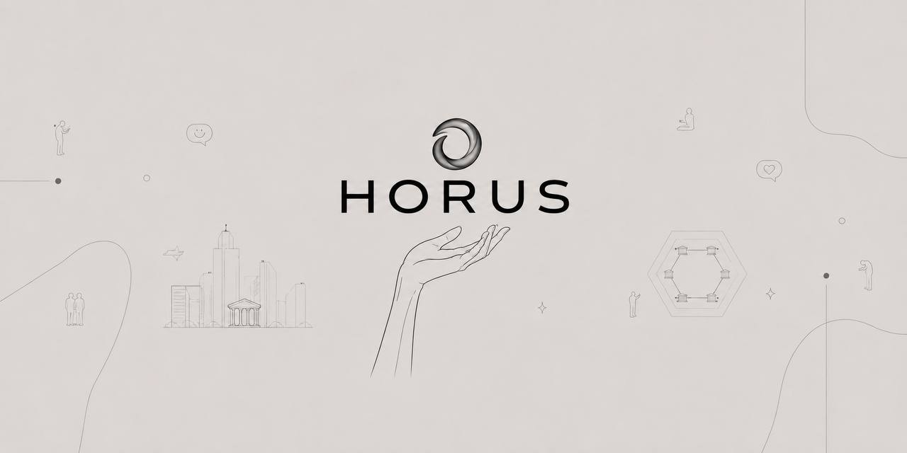

<div align="center">



**A privacy-preserving data marketplace on Solana.**
Sell *access* to your data — never the data itself.

[](https://github.com/usehorus/horus/actions)
[](#license)
[](spec/)
[]()
[]()

[Website](https://usehorus.xyz) · [Spec](spec/) · [Architecture](docs/architecture.md) · [Security model](docs/security-model.md)

</div>

---

> **Status: experimental — DO NOT USE IN PRODUCTION.**
> No security audit has been performed. Interfaces, on-chain accounts, and proof
> formats are unstable and change between releases. See [SECURITY.md](SECURITY.md).

## What HORUS is

HORUS is a protocol for trading **access to data without surrendering the data**.

A data owner encrypts a dataset client-side and lists it on-chain with a
*predicate commitment* — a binding promise about what the dataset contains
(row count, schema, freshness) that can later be proven in zero knowledge. A
buyer purchases a **time-boxed capability** that authorizes a bounded set of
queries. Payment settles on Solana through an escrow that releases to the owner
per answered query, minus a protocol fee. The raw bytes never leave the owner's
custody; the buyer receives query *results* plus a proof that the result was
computed correctly against the committed dataset.

The three properties HORUS is built around:

| Property | What it means |
|----------|---------------|
| **Data stays put** | Owners share access, not files. Capabilities expire and are revocable. |
| **Honest listings** | Predicate commitments are checkable in ZK — a listing can't lie about its data. |
| **Atomic settlement** | Escrow releases per-query on Solana; no off-chain trust between parties. |

## Architecture

```
                ┌─────────────┐      capability       ┌─────────────┐
   data owner ─►│  registry   │◄────────────────────► │  access     │
                │  (listings, │                        │  (grants,   │
                │  predicate  │      query + proof      │  scopes,    │
                │  commits)   │◄──────────────────────►│  expiry)    │
                └─────┬───────┘                        └──────┬──────┘
                      │ escrow ref                            │ usage
                      ▼                                        ▼
                ┌──────────────────────────────────────────────────┐
                │  settlement  (Solana escrow, per-query payout)     │
                └──────────────────────────────────────────────────┘
                      ▲                                        ▲
                      │  predicate / query-correctness proofs  │
                ┌─────┴────────────────────────────────────────┴──┐
                │  zk   (experimental — behind ENABLE_ZK_EXPERIMENTAL)│
                └──────────────────────────────────────────────────┘
```

See [docs/architecture.md](docs/architecture.md) for the full diagram and data flow.

## Spec index

Normative protocol definitions live in [`spec/`](spec/). Code follows the spec, not
the other way around.

| RFC | Title | Status |
|-----|-------|--------|
| [RFC-0001](spec/RFC-0001-overview.md) | Protocol overview & terminology | Accepted |
| [RFC-0004](spec/RFC-0004-access.md) | Capability-based access grants | Accepted |
| [RFC-0007](spec/RFC-0007-settlement.md) | Escrow & per-query settlement | Accepted |
| [RFC-0009](spec/RFC-0009-registry.md) | Dataset registry & predicate commitments | Draft |
| [RFC-0011](spec/RFC-0011-zk-predicates.md) | ZK predicate & query-correctness proofs | Experimental |

## Build

```bash
# Rust workspace (core + cli + sdk/rust)
cargo build --workspace

# run the unit suite (access + settlement engines)
cargo test --workspace

# experimental ZK paths are gated — opt in explicitly
cargo build --features zk-experimental
```

MSRV is `1.78`. The ZK paths additionally require a `circuits/` artifact directory
(not checked in); see [RFC-0011](spec/RFC-0011-zk-predicates.md).

## Running a gateway

A *gateway* answers buyer queries against a local dataset it custodies and posts
settlement proofs on-chain. It never serves raw rows.

```bash
horus gateway \
  --keypair ~/.config/solana/id.json \
  --dataset ./data/listing.enc \
  --commitment ./data/listing.commit.json \
  --cluster devnet
```

`--cluster mainnet` requires `ENABLE_MAINNET=true` and a release-candidate build.

## SDK matrix

| SDK | Package | Status | Notes |
|-----|---------|--------|-------|
| Rust | `horus-sdk` (`sdk/rust`) | 🟢 primary | Source of truth; other SDKs mirror it. |
| TypeScript | `@usehorus/sdk` (`sdk/ts`) | 🟡 beta | Browser + node; codegen'd types from Rust. |
| Python | `horus-sdk` (`sdk/py`) | 🟡 beta | Async client, pluggable signer. |

```ts
import { Horus } from "@usehorus/sdk";

const horus = await Horus.connect({ cluster: "devnet" });
const cap = await horus.buyAccess(listingId, { queries: 100, ttlSecs: 3600 });
const { rows, proof } = await horus.query(cap, "SELECT count(*) WHERE region = 'EU'");
await horus.verify(proof);            // result is correct against the committed dataset
```

## Security model

HORUS assumes a *malicious* counterparty on both sides and an *honest-but-curious*
gateway operator. Detailed threat model, trust assumptions, and the list of things
HORUS explicitly does **not** protect against are in
[docs/security-model.md](docs/security-model.md).

### Audit status

| Component | Reviewed | Notes |
|-----------|----------|-------|
| Access grants (`crates/horus-access`) | internal | External audit not yet scheduled. |
| Settlement (`crates/horus-settlement`) | internal | External audit not yet scheduled. |
| ZK proofs (`crates/horus-zk`) | none | Experimental; do not rely on soundness. |

## Contributing to the spec

Protocol changes start as an RFC in [`spec/`](spec/), not as a PR to a crate. Open a
discussion, get rough consensus, then implement. See [CONTRIBUTING.md](CONTRIBUTING.md).

## License

Licensed under either of [Apache License 2.0](LICENSE-APACHE) or
[MIT license](LICENSE-MIT) at your option.
